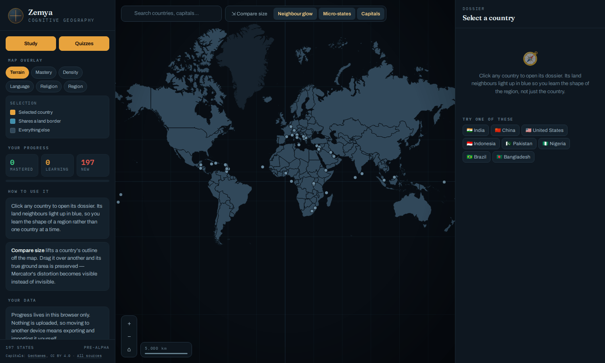
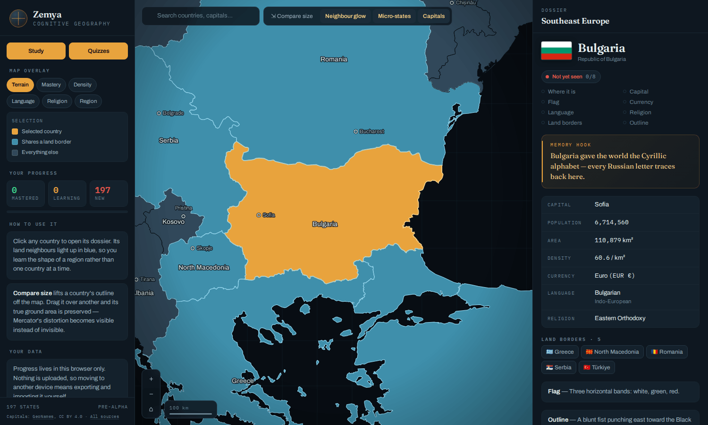
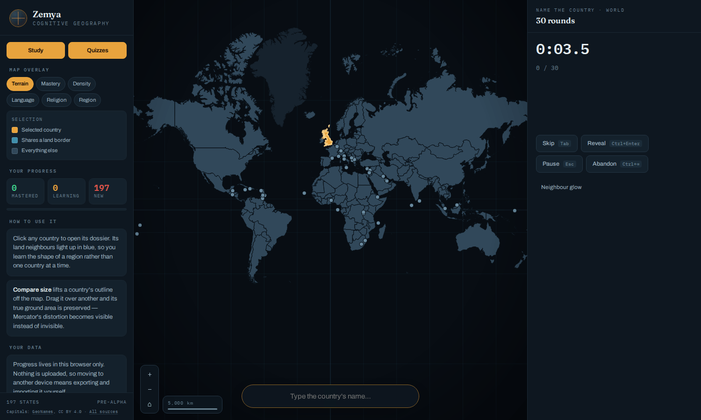
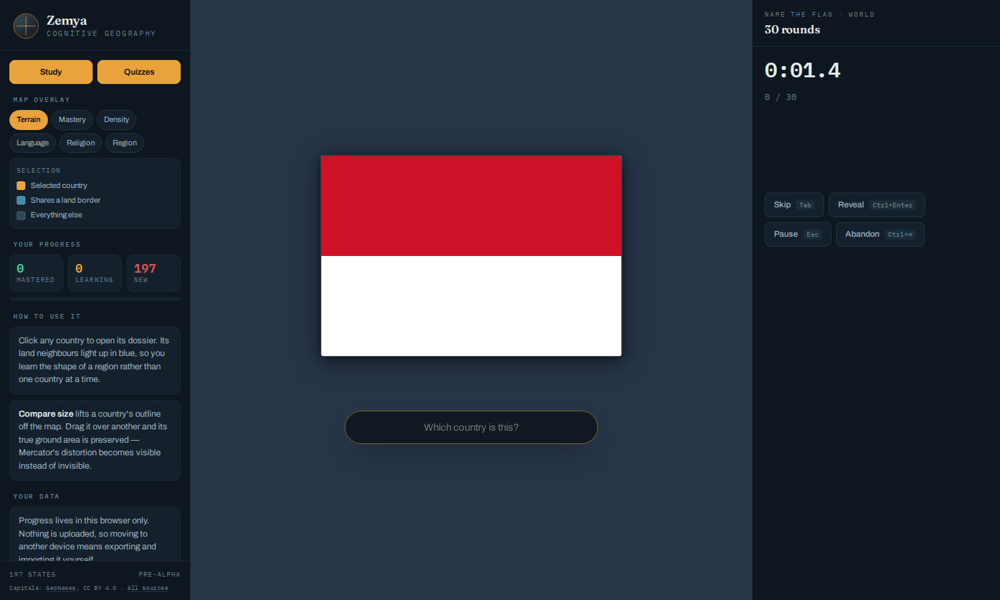
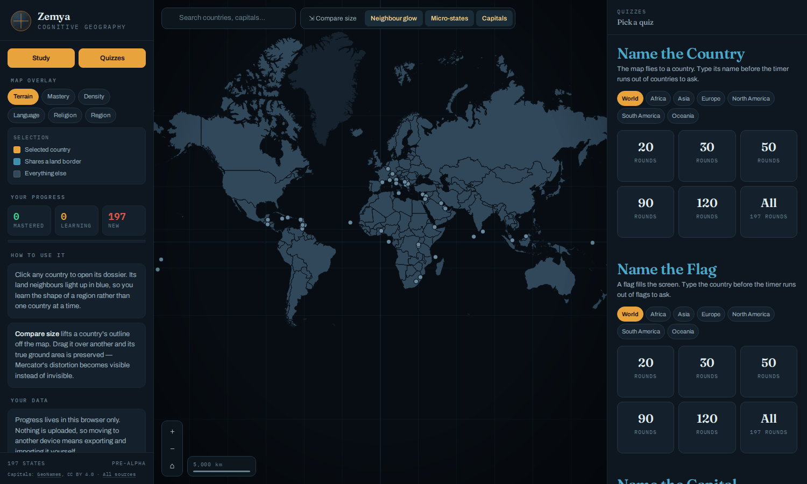

<div align="center">


# Zemya

**Typed geography quizzes for every country, flag and capital.**

<a href="https://zemya.study" target="_blank" rel="noopener noreferrer">
  
</a>

<br />

[](LICENSE)
[](https://react.dev)
[](https://www.typescriptlang.org)
[](https://vitejs.dev)
[](https://reactrouter.com)

### [🧭 Open the atlas → zemya.study](https://zemya.study)

<br />



</div>

---

## 📖 About

Zemya is an interactive atlas built for learning, not for looking things up. Every subject has one natural spatial index, and you learn by navigating it: geography's is the map (history's will be the timeline). You type the answer, the clock runs, and the app schedules what to show you next.

## ✨ Features

- 🎯 **Three quizzes** — name the country on the map, name the flag, name the capital.
- 🌍 **Every continent** — quiz the world or one continent, with sizes that adapt to the pool.
- ⌨️ **Typed and timed** — no multiple choice; personal bests and run history.
- 🧠 **Spaced repetition** — an FSRS card per country and fact decides what you see next.
- 📐 **True-size comparison** — drag a country over another and Mercator's distortion becomes visible.
- 📖 **197 country dossiers** — real flags, facts and a hand-written memory hook for each.
- 📴 **Offline-first, no account** — your progress lives in your browser; nothing is uploaded.

<table>
  <tr>
    <td width="50%"><br /><sub><b>Dossiers</b> — facts, memory hook, neighbours</sub></td>
    <td width="50%"><br /><sub><b>Name the Country</b> — find it on the map, type its name</sub></td>
  </tr>
  <tr>
    <td width="50%"><br /><sub><b>Name the Flag</b> — real flags at true aspect ratio</sub></td>
    <td width="50%"><br /><sub><b>Quiz catalogue</b> — pick a continent and a size</sub></td>
  </tr>
</table>

## 🛠️ Tech Stack

| Layer            | Technologies                                                  |
| ---------------- | ------------------------------------------------------------- |
| **Frontend**     | React 19 · TypeScript · React Router 8 (prerendered)          |
| **Map**          | Custom canvas renderer (full 1:10m coastlines)                |
| **Storage**      | Dexie (IndexedDB) · ts-fsrs (spaced repetition)               |
| **Build & test** | Vite · Vitest · Playwright                                    |
| **Hosting**      | Vercel (static files)                                         |

## 🚀 Getting Started

```bash
git clone https://github.com/kirilchobansky/zemya.git && cd zemya
npm install
npm run dev
```

Opens at `http://localhost:5173` (Node 20+). Project rules and decisions are in [CLAUDE.md](CLAUDE.md); architecture, quizzes, performance and deployment notes are in [docs/](docs/).

## 📚 Data sources

Every dataset the project uses, what it is for, and its licence. Licences were read from
each package's own `package.json` / `LICENSE` in `node_modules`, not from memory.

| Data | Used for | Licence |
| --- | --- | --- |
| [world-countries](https://github.com/mledoze/countries) 5.1 (mledoze/countries) | Country names and spellings, capitals, currencies, languages, borders, ISO codes | **ODbL-1.0** (share-alike; why `public/data/` is ODbL — see [LICENSE](LICENSE)). Its flag images are not part of that licence; we do not use them. |
| [Natural Earth](https://www.naturalearthdata.com/) 1:10m, via [world-atlas](https://github.com/topojson/world-atlas) 2.0 | Country polygons and the land layer | Natural Earth: public domain. world-atlas packaging: ISC. |
| [GeoNames](https://www.geonames.org/), via [all-the-cities](https://github.com/zeke/all-the-cities) 3.1 (build time only) | Capital-city coordinates and populations | **CC BY 4.0** (GeoNames' published licence) — **attribution required, credited in the app** (left rail footer). The npm package itself is MIT. |
| [svg-country-flags](https://github.com/hjnilsson/country-flags) 1.2 | The flag images in `public/flags/` | Public domain (the package's own declaration; national flags are not under copyright protection, though some countries restrict their use as emblems) |
| [countries-list](https://github.com/annexare/countries) 3.4 (dev only) | Second, independent source for `npm run audit` — never shipped in the data | MIT (the package's own `package.json`) |
| [country-json](https://github.com/samayo/country-json) 2.3 | Population fallback for countries without an authored figure | MIT (the package; it does not state a separate licence for its figures) |
| Hand-authored: memory hooks, flag and outline descriptions, religion, population overrides, aliases | Everything under `content/` | ODbL-1.0 with the rest of the data ([LICENSE](LICENSE)) |
| [Fraunces](https://fonts.google.com/specimen/Fraunces), [Archivo](https://fonts.google.com/specimen/Archivo), [IBM Plex Mono](https://fonts.google.com/specimen/IBM+Plex+Mono) | Type, loaded from Google Fonts | SIL Open Font License 1.1 |

Runtime and build dependencies, from their own `package.json`: dexie Apache-2.0 ·
ts-fsrs MIT · react, react-dom, react-router MIT · isbot Unlicense · topojson-client,
topojson-simplify, yaml ISC · dev tooling (vite, vitest, TypeScript, Playwright,
fake-indexeddb, @react-router/*) MIT or Apache-2.0.

A new dataset gets its licence checked and recorded in this table **before** it is used,
and anything requiring attribution is credited in the app, not only here.

## 📄 Licence

Dual-licensed: code **MIT**, data (`content/` and `public/data/`) **ODbL-1.0**. See
[LICENSE](LICENSE) for the split and the reason for it.
